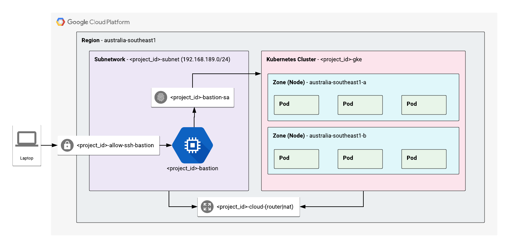

# GKE Bootstrap - Deployment Manager

---

## Architecture

---



---

## Setup

---

### Deploy Script Usage

```bash
./deploy.sh <project_id> <resource> <action>
```

Resources must be deployed and removed in the following order

| create             | delete              |
|--------------------|---------------------|
| IAM                | Bastion             |
| Network            | GKE                 |
| Cloud Router (NAT) |  Cloud Router (NAT) |
| GKE                | Network             |
| Bastion            | IAM                 |

#### IAM

Deployment manager needs IAM permissions for particular tasks. We can temporarily add these permissions using the following

```bash
# Create
./deploy.sh <project_id> iam create

# Delete
./deploy.sh <project_id> iam delete
```

#### Network

```bash
# Create
./deploy.sh <project_id> network create

# Delete
./deploy.sh <project_id> network delete
```

#### Cloud Router (NAT)

```bash
# Create
./deploy.sh <project_id> cloud-router create

# Delete
./deploy.sh <project_id> cloud-router delete
```

#### GKE

```bash
# Create
./deploy.sh <project_id> gke create

# Delete
./deploy.sh <project_id> gke delete
```

#### Bastion

```bash
# Create
./deploy.sh <project_id> bastion create

# Delete
./deploy.sh <project_id> bastion delete
```

---

## Manage

---

### Connect

Connect to the bastion host and manage the kubernetes cluster from there using the steps below

#### SSH Bastion

```bash
gcloud compute ssh <project_id>-bastion \
    --project <project_id> \
    --zone australia-southeast1-a
```

#### Kubernetes Connect

```bash
gcloud container clusters get-credentials <project_id>-gke \
    --project <project_id> \
    --region australia-southeast1
```

#### Role-based Access Control (RBAC)

We'll deploy an RBAC configuration that is used by helm. Perform the following actions from the Bastion server

```bash
# Pull the repo along with rbac config to bastion server
git clone https://github.com/t04glovern/gke-dm-bootstrap.git
cd gke-dm-bootstrap/k8s

# Create tiller service account & cluster role binding
kubectl create -f rbac-config.yaml

# init helm with the service account
helm init --service-account tiller --history-max 200
```

## Attribution

- RBAC Configuration Example - [https://github.com/helm/helm/blob/master/docs/rbac.md](https://github.com/helm/helm/blob/master/docs/rbac.md)
- Deployment Manager samples - [https://github.com/GoogleCloudPlatform/deploymentmanager-samples](https://github.com/GoogleCloudPlatform/deploymentmanager-samples)
  - [cloud_router](https://github.com/GoogleCloudPlatform/deploymentmanager-samples/tree/master/community/cloud-foundation/templates/cloud_router)
  - [firewall](https://github.com/GoogleCloudPlatform/deploymentmanager-samples/tree/master/community/cloud-foundation/templates/firewall)
  - [gke](https://github.com/GoogleCloudPlatform/deploymentmanager-samples/tree/master/community/cloud-foundation/templates/gke) - with modifications from [Praveen Chamarthi](https://github.com/GoogleCloudPlatform/deploymentmanager-samples/pull/326)
  - [iam_member](https://github.com/GoogleCloudPlatform/deploymentmanager-samples/tree/master/community/cloud-foundation/templates/iam_member)
  - [network](https://github.com/GoogleCloudPlatform/deploymentmanager-samples/tree/master/community/cloud-foundation/templates/network)